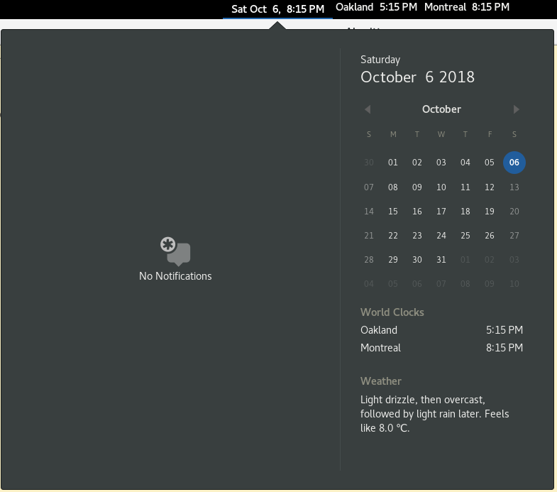

An attempt at a gnome-extension to display time from the world clocks configured in Gnome Clocks on the top bar.

The code is mostly copied from https://github.com/GNOME/gnome-shell/blob/master/js/ui/dateMenu.js#L86

This extension displays the same content as the World Clocks panel in the calendar pop-out, except in the top bar:

